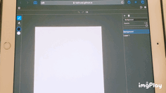

# Mira

Mira is a simple Painting/Drawing soft for browser in iPad & Apple Pencil.

__[Live demo is here](https://toshusai.github.io/mira/)__

## Features

> :white_check_mark: OK  
:eight_spoked_asterisk: Partially  
:construction: Work in progress

### Tools
- Pencil :white_check_mark:
  -  Opacity :white_check_mark:
     -  By pencil pressure :white_check_mark:
  -  Size :white_check_mark:
     -  By pencil pressure :white_check_mark:
  -  Color :white_check_mark:
     -  Color picker (H slider + SV rectangle) :white_check_mark:
     -  Text :construction:
        -  RGB 0-1 :construction:
        -  RGB 0-255 :construction:
        -  RGB Hex :construction:
- Eraser :white_check_mark:
  -  Opacity :white_check_mark:
     -  By pencil pressure :white_check_mark:
  -  Size :white_check_mark:
     -  By pencil pressure :white_check_mark:
- Sampler :construction:
- Fill :construction:
- Select :construction:
  - Rect :construction:
  - Free :construction:
  - Transform (Homography) :construction:

### Layers
- Layers :white_check_mark:
  - Add/Delete :white_check_mark:
  - Change order :white_check_mark:
  - Opacity :construction:
  - Blend mode :construction:
  - Mask :thinking:

### Import/Export
- Import :eight_spoked_asterisk:
  - psd :eight_spoked_asterisk:
  - png/jpg/webp as a layer :construction:
- Export :eight_spoked_asterisk:
  - psd :eight_spoked_asterisk:
  - png/jpg/webp :construction:
  - down/up size :construction:

### Controls
- :point_up_2: Move with one finger :white_check_mark:
- :v: Zoom with tow fingers :white_check_mark:
- :v: Rotate with tow fingers :construction:
- Undo/Redo :white_check_mark:
- Keyboard shortcuts :construction:
- Flip canvas :white_check_mark:

### Canvas
- Change width/height :white_check_mark:

### Others
- Color palette :construction:
- Draw by finger :construction:
- More brushes :thinking:
